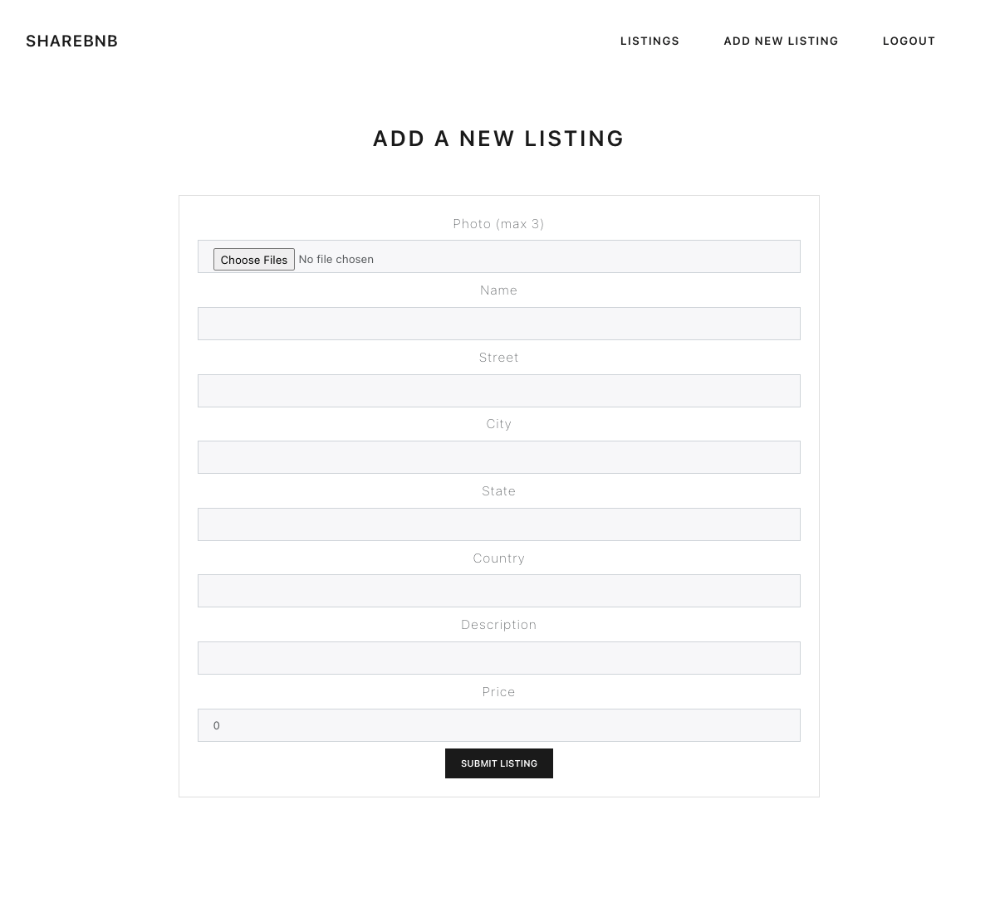

# Share B&B Back End 
JSON API application using NodeJS/Express with resources on listings and users. This application uses:
- NodeJS/Express
- PostgreSQL
- Jest supertest

# How to use API
In root directory, run the following command: node server.js As with other RESTful APIs, it's helpful to use a platform like Insomnia to see test how the application responds to different requests.

The listing and user routes require user authentication. When you login or sign up, the app will return a token which you can then send along with your other requests.

# Project Screen Shots

# Routes
## Listings
<ul>
<li>GET /listings: returns list of all listings. This route also accepts the following query parameters to filter results: name, city, state, country, minPrice and maxPrice. For example, the following get request can expect a resource of all listings with the word california in the state  
baseurl/listings?state=california</li>

<li>POST /listings: Adds a new listing to database. Requires admin authorization.</li>

<li>GET /listings/<id> with id being the listing id, will receive a resource on all details for that listing.</li>

<li>UPDATE/DELETE /listings/<id>: requests can be made to a specific listing where the id is the listing's id. This route requires admin authorization.</li>
</ul>

## Users
<ul>
<li>GET /users: returns list of all users in database. </li>
<li>POST /users: Adds a new user to database. Requires admin authorization.</li>
<li>GET /users/<id> with id being the user id will receive a resource on all details for that user.</li>
<li>UPDATE/DELETE user/<id> update and delete requests can be made to a specific user where the id is the user id. This route requires admin authorization.</li>
</ul>

# Testing
In root directory, run the following command: jest

